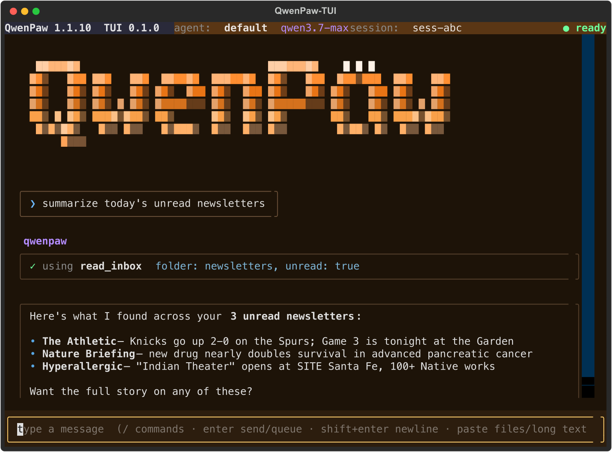

# QwenPaw-TUI

A terminal chat UI for [QwenPaw](https://github.com/agentscope-ai/QwenPaw).

QwenPaw-TUI is a small, fast [Textual](https://textual.textualize.io/) front-end
for an **existing** QwenPaw installation. It spawns `qwenpaw acp` and drives it
over **ACP** (Agent Client Protocol) — streaming replies and thinking, rendering
tool calls as inline panels, handling permission prompts, and forwarding slash
commands (`/clear`, `/compact`, …) straight to the agent. Its command-line
tool is `paw`.

It only speaks ACP and never imports QwenPaw, so it stays light and ships
independently. Everything else — provider keys, model selection, memory,
tools — lives in QwenPaw; paw just drives the agent you've already configured.

<p align="center">
  
</p>

## Install

Install **QwenPaw first** (see the
[QwenPaw](https://github.com/agentscope-ai/QwenPaw) docs), then install the UI:

```bash
pip install qwenpaw-tui   # finds `qwenpaw` on your PATH
```

paw does **not** bundle or install QwenPaw, so there's nothing to conflict
with your existing setup — it just drives whatever `qwenpaw` is on your `PATH`
(or an explicit `--agent-cmd`).

## Usage

```bash
paw                              # interactive chat with your QwenPaw
paw --agent writer               # pick a specific agent
paw --agent-cmd "qwenpaw acp"    # drive an explicit ACP command
```

For non-interactive / one-shot use, run QwenPaw directly: `qwenpaw chat`.

Inside the chat: `enter` sends, `shift+enter` inserts a newline, `esc`
interrupts the current turn, `ctrl+r` runs voice input, and `ctrl+c` quits.

Type `/` to open an overlay suggestion list. It includes paw's own commands,
QwenPaw commands advertised over ACP, and argument completions such as
`/theme cyberpunk`. Use `up`/`down` to pick, `tab` or `enter` to insert a
highlighted suggestion, and `esc` to dismiss. Once an exact full command is
typed, `enter` submits it.

Useful local commands:

- `/theme` opens the theme gallery; `/theme <prompt>` generates a persistent
  vibe from your words.
- `/voice` inserts dictated text from `PAW_VOICE_COMMAND`.
- `/inspect` toggles between friendly chat and deeper tool/thought inspection.

Model and provider commands (e.g. `/model`) are QwenPaw's — paw forwards them
to the agent. Configure providers and models with QwenPaw's own tools
(`qwenpaw models config-key`, `qwenpaw models set-llm`).

Pasting a file path or data URL attaches it to the prompt. Pasting long text
stores it as a temporary attachment and inserts a reference, keeping the input
usable.

## How it finds QwenPaw

`paw` resolves the agent to drive in this order:

1. `--agent-cmd "<command>"` — used verbatim.
2. **PATH** — runs `qwenpaw acp`.

If QwenPaw isn't on your `PATH`, install it first or pass `--agent-cmd`.

## How it works

`paw` is an ACP **client**. It spawns the QwenPaw agent as a subprocess and
exchanges JSON-RPC over stdio. Because QwenPaw already ships a full ACP
agent (`qwenpaw acp`), paw reuses the backend for tools, memory, advertised
slash commands, permissions, and model switching.

The agent's stderr is drained to a log file under paw's state dir
(`PAW_STATE_DIR`, or an OS default) so chatty tools (e.g. a headless browser)
can't deadlock the stdio stream.

## Develop

```bash
pip install -e ".[dev]"
pytest -m "not integration"  # unit + transport + UI + CLI tests
```

Run the live development-checkout integration tests with provider keys:

```bash
DASHSCOPE_API_KEY=... \
OPENAI_API_KEY=... \
ANTHROPIC_API_KEY=... \
GEMINI_API_KEY=... \
DEEPSEEK_API_KEY=... \
  pytest tests/test_qwenpaw_dev_integration.py -m integration -vv
```

The integration suite defaults to
`/Users/erkang.zhu/code/ContinueLearningBench/submodules/QwenPaw`, or set
`QWENPAW_DEV_CHECKOUT=/path/to/QwenPaw`. It starts QwenPaw through
`uv run --project <checkout> python -m qwenpaw acp`, verifies the imported
module comes from that checkout, and sets temporary `QWENPAW_WORKING_DIR`,
`QWENPAW_SECRET_DIR`, and `PAW_STATE_DIR` so it does not write to
`~/.qwenpaw` or `~/.copaw`. It covers multi-turn conversation, a live
`read_file` tool call through ACP, and two-turn provider smoke tests for
DashScope, OpenAI, Anthropic, Gemini, and DeepSeek. Provider cases skip
cleanly if the corresponding API key is absent.

Default live-test models can be overridden with:

- `PAW_E2E_DASHSCOPE_MODEL`
- `PAW_E2E_OPENAI_MODEL`
- `PAW_E2E_ANTHROPIC_MODEL`
- `PAW_E2E_GEMINI_MODEL`
- `PAW_E2E_DEEPSEEK_MODEL`

### Against a local QwenPaw checkout

To test paw against an in-development QwenPaw (e.g. a sibling `../QwenPaw`
editable install) without touching your normal QwenPaw setup, point `paw` at
that checkout's interpreter with `--agent-cmd`, and isolate its data with
`QWENPAW_WORKING_DIR`:

```bash
QWENPAW_WORKING_DIR="$PWD/.devdata" \
  paw --agent-cmd "/path/to/QwenPaw/.venv/bin/python -m qwenpaw acp"
```

`paw` forwards its environment to the spawned agent, so any vars you set
(`QWENPAW_WORKING_DIR`, provider keys, etc.) reach QwenPaw. The agent uses
`.devdata`/`.devdata.secret` for its config, sessions, and secrets, leaving
`~/.qwenpaw` untouched.

First time, seed a provider key and pick a model **into `.devdata`** using
QwenPaw's own config (run the dev interpreter with the same working dir):

```bash
DEV="/path/to/QwenPaw/.venv/bin/python"
# store an API key for a provider (id: `dashscope` or `openai`) — paste the
# key at the prompt, e.g. $DASHSCOPE_API_KEY / $OPENAI_API_KEY
QWENPAW_WORKING_DIR="$PWD/.devdata" "$DEV" -m qwenpaw models config-key dashscope
# then choose the active model
QWENPAW_WORKING_DIR="$PWD/.devdata" "$DEV" -m qwenpaw models set-llm
```

The key is encrypted into `.devdata.secret`, so it stays out of your normal
install (and out of git).

## License

MIT
